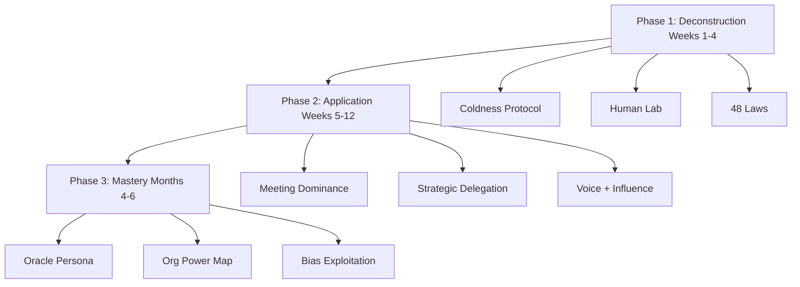

# PROJECT: CHIMERA
## Transformation Doctrine — Friendly Manager → Feared Leader
### Classification: Operational / Personal Dominance
### Duration: 6 Months | Owner: You | Mode: Execute Without Negotiation

---

> **"They mistook your accessibility for equality. Correct the error. Permanently."**

You did not lose authority because you are weak. You lost it because you gave it away — through smiles, open doors, soft language, and peer-level warmth. Subordinates do not respect the man who wants to be liked. They test him. Then they climb over him.

Chimera is the reverse engineering of that mistake. You will dismantle the friendly persona, install cold competence, weaponize psychology, and automate dominance until the old version of you is a corpse in the archive.

**Operating definition of "fear" in this doctrine:**
Not screaming. Not cruelty theater. Not HR-triggering abuse.
**Fear = the certainty that crossing you has professional consequences, that you see through them, that you are three moves ahead, and that your favor is scarce.**

Respect without consequence is decoration. Consequence without competence is tyranny. You will build both.

---

## TABLE OF CONTENTS

1. [Mission Parameters](#mission-parameters)
2. [Phase Architecture](#phase-architecture)
3. [Phase 1 — The Foundation (Weeks 1–4)](#phase-1--the-foundation-weeks-14)
4. [Phase 2 — The Accelerant (Weeks 5–12)](#phase-2--the-accelerant-weeks-512)
5. [Phase 3 — The God-Tier (Months 4–6)](#phase-3--the-god-tier-months-46)
6. [Master KPI Dashboard](#master-kpi-dashboard)
7. [Human Lab Spreadsheet Template](#human-lab-spreadsheet-template)
8. [Mission Briefing (Daily Read)](#mission-briefing-daily-read)
9. [Integration With Existing Protocols](#integration-with-existing-protocols)

---

## MISSION PARAMETERS

| Parameter | Spec |
|-----------|------|
| **Primary enemy** | Your old persona: over-available, soft-edged, peer-coded |
| **Primary outcome** | Intellectual + hierarchical dominance over your team |
| **Secondary outcome** | Accelerated career progression via political fluency |
| **Hard constraint** | No public humiliation that creates martyrs; correct privately, decide publicly |
| **Cultural calibration** | Indian corporate hierarchy — cold politeness beats loud aggression |
| **Weekly time budget (Phase 1)** | 7–9 hrs active practice + 3–4 hrs observation/logging |
| **Weekly time budget (Phase 2)** | 10–12 hrs active application + 2 hrs weekly review |
| **Weekly time budget (Phase 3)** | 6–8 hrs refinement (automation reduces deliberate practice) |

### Non-Negotiable Rules of Engagement

1. **Never announce the transformation.** People who declare "I'm changing" invite sabotage.
2. **Withdraw warmth before you add pressure.** Scarcity first. Consequence second.
3. **Document everything.** Memory is political. Email is power.
4. **Never fight for status with juniors in public.** Crush ideas with structure; crush attitudes with process.
5. **Protect upward relationships.** Chimera targets peer erosion below you — not scorched earth with your boss.

---

## PHASE ARCHITECTURE



| Phase | Window | Codename | Core Shift |
|-------|--------|----------|------------|
| 1 | Weeks 1–4 | Deconstruction & Re-calibration | Stop leaking peer energy |
| 2 | Weeks 5–12 | Application & Dominance | Actively reclaim the room |
| 3 | Months 4–6 | Mastery & Automation | Become the default authority |

---

# PHASE 1 — THE FOUNDATION (WEEKS 1–4)
## "Deconstruction & Re-calibration"

### Objective
Systematically dismantle the friendly persona and install a cold foundation **without workplace chaos**. You are not exploding into a villain on Monday. You are cooling the room degree by degree until people feel the weather change and cannot name the storm.

### Phase 1 Progress Markers (KPIs)
Track weekly. Score 0/1.

| KPI | Target by End of Week 4 |
|-----|-------------------------|
| Unsolicited small talk directed at you | Down ≥50% from baseline |
| "Hey bro / yaar / free for 2 min?" interruptions | Down ≥40% |
| You say "sorry" in work chat (non-error) | Zero |
| Decisions delivered as statements, not proposals | ≥80% of your directives |
| Door / availability is controlled | Office hours enforced 4/5 days |
| Human Lab sheets completed | 100% of direct reports |
| 48 Laws reading + workplace notes | On schedule (Laws 1–48) |

**Baseline ritual (Day 0, Sunday night):** Count how many times subordinates initiate casual chat with you in a normal week. Write the number. That number is the enemy.

---

## 1A. BEHAVIORAL OVERHAUL — THE "COLDNESS" PROTOCOL

### Banned Phrases → Command Replacements

| BANNED (Peer Energy) | REPLACE WITH (Authority Energy) |
|----------------------|----------------------------------|
| "I think we should…" | "The plan is…" / "We will…" |
| "Maybe we can…" | "This will be…" |
| "Sorry to bother you" | "Need this by 3 PM." |
| "No worries!" / "All good!" | "Noted." / "Proceed." |
| "Does that make sense?" | "Confirm you have this." |
| "Feel free to…" | "Do this." / "Owner: you. Deadline: X." |
| "Just checking in…" | "Status on X by EOD." |
| "Happy to help!" | "Send the blocker in writing." |
| "What do you guys think?" (when you already know) | "Decision: we go with A. Objections with data only." |
| "Sorry for the delay" (when delay was theirs) | "Update your ETA." |
| "Can we maybe sync quickly?" | "Meeting at 3. 15 minutes. Agenda attached." |
| "I'm not sure, but…" | Silence — then research — then decide |
| "LOL" / emojis in work chat | Remove. Cold text only. |
| "Take your time" | "Deadline is Thursday 5 PM." |
| "Hope you're doing well!" (status emails) | Cut the greeting fluff. Start with the ask. |

### Email / Chat Rewrites (Exact)

**BEFORE (Friendly corpse):**
> Hey! Hope you're doing great 😊  
> Sorry to bother you — just wanted to quickly check if maybe we could sync on the configurator issue when you get a chance? No rush at all! Happy to help however works for you.  
> Thanks so much!

**AFTER (Chimera):**
> Status needed on configurator issue.  
> Blockers + ETA by 3 PM today.  
> If blocked, name the dependency.

---

**BEFORE:**
> Guys, I think we should maybe reconsider the approach? Happy to hear thoughts — no wrong answers! 😅

**AFTER:**
> Decision: we are not shipping Approach A.  
> It fails load constraint X and timeline Y.  
> Approach B is the path. Owner: [Name]. First checkpoint: Wednesday 11 AM.

---

**BEFORE:**
> Totally get where you're coming from! Maybe we can find a middle ground?

**AFTER:**
> Understood. The requirement stands.  
> Deliver Option 1 by Friday, or escalate with a written risk note today.

---

### Daily Script — Week 1 (Say This / Do Not Say That)

Execute these lines verbatim until they become muscle memory.

#### Day 1 — Monday: The Temperature Drop
- **Morning arrival:** Walk to desk. Nod once if greeted. Do not stop for banter.
- **First Slack/Teams ping ("Got a minute?"):**  
  **"Send it in writing. I'll respond by [time]."**
- **If they appear at your desk uninvited:**  
  **"I'm in a focus block until 12. Put it in chat with the decision you need from me."**
- **Banned today:** jokes, personal questions, "how's it going," lunch invites acceptance (defer: "Not today.")
- **End of day self-check:** Did I smile more than twice at subordinates? If yes, note it. Reduce tomorrow.

#### Day 2 — Tuesday: Statement Mode
- Every request you make ends with **owner + deadline**. No exceptions.
- Template: **"Need [deliverable] from you by [time]. Confirm."**
- In standup: speak last or near-last. Keep updates under 40 seconds. No self-deprecation.

#### Day 3 — Wednesday: Silence Weapon
- In 1:1s and desk chats: after they finish speaking, **count 3 full seconds** before you respond.
- Do not fill silence with "yeah yeah" or head-nod theater.
- Line when they ramble: **"Bottom line in one sentence."**

#### Day 4 — Thursday: Correction Without Softening
- When quality is low: **"This is below the standard. Fix X and Y. Resubmit by [time]."**
- Do not add "but I know you're trying" or "it's okay."
- Private channel only for attitude. Public channel only for work facts.

#### Day 5 — Friday: Scarcity Close
- No "fun Friday" energy with the team.
- Line: **"Wrap open items before you leave. I want statuses in the tracker by 5."**
- Weekend: do not reply to non-urgent chat. Train them that your attention is not 24/7.

#### Days 6–7 — Weekend Drill
- No social leakage with colleagues on WhatsApp.
- Complete Human Lab sheets.
- Read assigned Laws.
- 10-minute presence drill both days.
- Journal: 5 instances where old-you would have been warm — and what cold-you did instead.

### Week 2–4 Communication Escalation

| Week | Communication Rule |
|------|--------------------|
| 2 | Add **consequence language**: "If this slips, we escalate to [manager/client impact]." |
| 3 | Start **selective recognition**: praise only exceptional work, in writing, briefly. Never praise effort alone. |
| 4 | Install **ritual distance**: they book you; you do not hover. Your default answer to drive-by asks is the office-hours redirect. |

---

## 1B. BODY LANGUAGE & PRESENCE

### How You Walk
- **Pace:** 10–15% slower than your current hurried walk. Rushed people look junior.
- **Stride:** Medium-long, heel-to-toe, consistent. No shuffling. No phone-in-hand zombie walk through the floor.
- **Arms:** Natural swing, not in pockets, not crossed while walking.
- **Gaze:** Destination-focused. Acknowledge people with a short nod, not a grin campaign.
- **Stop rule:** If someone tries to intercept you in the corridor with a "quick thing," keep walking half a step, then: **"Chat. Bullet points. I'll respond after [time]."**

### How You Stand in Meetings
- **Feet:** Shoulder-width, weight evenly distributed. Do not lean on the chair back like a spectator.
- **Spine:** Tall. Chin level. Shoulders down.
- **Hands:** Rest on table, fingers steepled lightly or flat. No fidget pen. No face-touching.
- **Laptop:** Closed for the first 10 minutes unless you are presenting. Open laptop = social disappearing act.
- **Seat choice:** Where you can see the door and most faces — not the corner hideout.

### Eye Contact Protocol
| Mode | Use When | Execution |
|------|----------|-----------|
| **Normal lock** | Standard discussion | Hold 3–4 seconds, break briefly to notes, return |
| **Unblinking stare** | Challenge, interruption, disrespect | Hold 5–7 seconds in silence after they finish. Do not nod. Then respond coldly. |
| **Dismissive break** | Wasted airtime | Look to notes, write one line, then: "Next." |

**Rule:** The unblinking stare is a scalpel, not a lifestyle. Overuse makes you look unhinged. Use it when status is being tested.

### 10-Minute Daily Presence Drill (Mirror — Before Morning Coffee)

Do this every morning. Phone timer. No skipping.

| Minute | Drill |
|--------|-------|
| 0:00–2:00 | **Still face:** Neutral expression. No micro-smile. Breathe through nose. |
| 2:00–4:00 | **Unblinking stare:** Focus on your own left eye in the mirror. Blink only as needed. Soften jaw. |
| 4:00–6:00 | **Command lines aloud** (downward inflection): "The plan is locked." "Deadline is Friday." "That approach fails." "Confirm ownership." |
| 6:00–8:00 | **Posture stack:** Wall angel or stand against wall — head, shoulders, hips touching. Then step away keeping the line. |
| 8:00–10:00 | **Silence hold:** Imagine a subordinate challenging you. Stare. Count to 5. Deliver one sentence kill-shot. Repeat 3 scenarios. |

**Measurable standard:** Record one 30-second video weekly (Friday). Compare Week 1 vs Week 4: less smiling, slower speech, lower fidget.

---

## 1C. ENVIRONMENT CONTROL — PSYCHOLOGICAL DISTANCE

### Availability Architecture
1. **Kill the open door myth.** Open door was how they colonized your attention.
2. **Install Office Hours:** e.g. **11:30–12:00** and **4:00–4:30** for drop-ins. Outside that: written only.
3. **Calendar as shield:** Block 2–3 focus blocks daily labeled `Deep Work — Do Not Schedule` (or equivalent). Protect them.
4. **Desk signal:** Headphones on = do not interrupt. Enforce it once, firmly, and they will learn.
5. **Physical placement:** If you control seating, increase distance from the loudest oversmart peer-wannabe.

### Silence as Dominance
- After you ask a hard question, **stop talking**.
- After you assign a deadline, **stop talking**.
- After they make an excuse, **silence for 3 seconds**, then: **"So what's the new ETA?"**
- Never rescue them from awkwardness. Awkwardness is the tuition they pay for wasting your time.

### Distance Behaviors (Daily Checklist)
- [ ] No lunch with the full squad more than 1x/week (Phase 1 max)
- [ ] No venting to subordinates
- [ ] No personal life dumps
- [ ] No "we're all in this together" speeches
- [ ] One controlled friendly gesture per week max (strategic, not needy)

---

## 1D. PSYCHOLOGICAL WARFARE — INFORMATION GATHERING

### Human Lab Analysis Framework
You will stop guessing. You will profile.

For each subordinate, fill the sheet below within **Week 1–2**. Update monthly.

#### Digital Spreadsheet Template (Copy into Sheets / Excel)

**Sheet name:** `CHIMERA_HUMAN_LAB`

| Column | Definition | Example entries |
|--------|------------|-----------------|
| A. Name | Full name + role | Rohan — FE Dev |
| B. Rank Threat | 1–5 how much they erode your authority | 5 = oversmart challenger |
| C. Primary Motivator | Praise / Fear / Money / Challenge / Status / Security | Challenge + Status |
| D. Primary Fear | Incompetence exposure / Irrelevance / Conflict / Job loss / Public shame / Being ignored by leadership | Incompetence exposure |
| E. Key Triggers (Negative) | What makes them emotional or defiant | Being corrected in public; slow code review |
| F. Compliance Triggers | What makes them fall in line | Clear scoreboard; private challenge; senior visibility |
| G. Strategic Lever | How you move them | Assign hard ambiguous problems + demand written reasoning; never argue verbally |
| H. Evidence Log | Dates + behaviors observed | 03-Aug: contradicted you in standup smiling |
| I. Counter-Move Used | What you did | Asked for data; silence; reassigned ownership |
| J. Result | What changed | Interrupted less next day |
| K. Alliance Risk | Do they go around you to your boss? Y/N | Watch |
| L. Replacement Difficulty | Hard / Medium / Easy | Medium |
| M. Current Stance Toward You | Peer / Tester / Compliant / Ally / Silent blocker | Tester |

**Rules of the Lab:**
- Never show this file to anyone.
- Do not profile based on one bad day. Need 3+ behavioral samples.
- Re-rank Threat monthly.
- Your goal is not cruelty. Your goal is **predictable control**.

### Profiling Questions (Observe — Do Not Interrogate)
Watch for 10 days:
1. Do they seek praise after small tasks?
2. Do they argue in public or private?
3. Do they fear looking stupid in front of seniors?
4. Do they optimize for money/promotion talk?
5. Do they only respect force (deadlines + escalation paths)?
6. Who do they imitate?
7. Who do they fear disappointing?

---

## 1E. REQUIRED READING — *THE 48 LAWS OF POWER*

**Book:** Robert Greene — *The 48 Laws of Power*  
**Phase 1 mandate:** Finish all 48 laws in 4 weeks with workplace application notes.

### 4-Week Reading Schedule (~3 laws/day on workdays; catch-up on weekends)

**Method for each law (non-negotiable):**
1. Read the law.
2. Write 4–8 lines in your Chimera journal:
   - **Seen:** Where you have watched this law used (office/life)
   - **Apply:** Exact move you will make in the next 7 days
3. Mark Apply items with a date. Execute at least **4 Apply moves per week**.

#### Week 1 — Laws 1–15 (Identity & Distance)
| Day | Laws | Focus lens for workplace notes |
|-----|------|--------------------------------|
| Mon | 1–3 | Never outshine the boss upward; monopolize attention downward carefully; conceal intent of Chimera |
| Tue | 4–6 | Say less; guard reputation; court attention from seniors at the right altitude |
| Wed | 7–9 | Use others' work strategically; make people come to you; win through actions, not argument |
| Thu | 10–12 | Avoid miserable energy sinks; make yourself necessary; use selective honesty |
| Fri | 13–15 | Ask for help as strategy upward; pose as friend while profiling; crush rivals by isolating problems not people |
| Sat–Sun | Catch-up + Apply review | Execute 4 applications; update Human Lab |

#### Week 2 — Laws 16–27 (Scarcity & Control)
| Day | Laws |
|-----|------|
| Mon | 16–18 |
| Tue | 19–21 |
| Wed | 22–24 |
| Thu | 25–27 |
| Fri | Review + 4 applications |
| Weekend | Deep-dive Laws that match your biggest subordinate threat |

**Priority applications Week 2:** Law 16 (scarcity of access), Law 19 (know who you're dealing with), Law 22 (tactical surrender when boss is wrong publicly — document privately).

#### Week 3 — Laws 28–39 (Boldness & Timing)
| Day | Laws |
|-----|------|
| Mon | 28–30 |
| Tue | 31–33 |
| Wed | 34–36 |
| Thu | 37–39 |
| Fri | Review + 4 applications |

**Priority:** Law 28 (boldness in decisions), Law 31 (control options), Law 36 (disdain things you cannot have — ignore bait arguments).

#### Week 4 — Laws 40–48 (Endgame Foundations)
| Day | Laws |
|-----|------|
| Mon | 40–42 |
| Tue | 43–45 |
| Wed | 46–48 |
| Thu–Fri | Full synthesis: top 10 laws for YOUR office |
| Weekend | Write your personal **Power Constitution** — 10 rules you will live by at work |

---

## 1F. TIME ALLOCATION — PHASE 1

| Activity | Hours / Week | Mode |
|----------|--------------|------|
| Active behavior practice (scripts, silence, stare, email tone) | **5 hrs** | Active |
| Presence drill (10 min/day × 7) | **1.2 hrs** | Active |
| Human Lab observation + logging | **2 hrs** | Passive → Active logging |
| 48 Laws read + application notes | **3 hrs** | Study |
| Weekly self-review (Sunday 30–45 min) | **0.75 hrs** | Analysis |
| **Total** | **~12 hrs** | — |

**Split rule:** ~60% active installation of new behaviors / ~40% observation + study in Phase 1.  
Do not skip observation. Blind aggression without profiles creates enemies you don't understand.

### Phase 1 Weekly Cadence

| Day | Non-negotiables |
|-----|-----------------|
| Daily | Presence drill; banned-phrase audit; office-hours enforcement |
| Mon | Set week's authority targets (2 behavioral, 1 political) |
| Wed | Mid-week KPI check (interruptions, soft language count) |
| Fri | 30s presence video; evidence log update |
| Sun | Human Lab updates; Laws catch-up; Week plan |

### Phase 1 Exit Criteria (Do Not Advance Early)
You may enter Phase 2 only if:
1. Soft language is mostly extinct in your written communication.
2. At least half your direct reports show reduced casual access behavior.
3. Human Lab is complete for all directs.
4. You can hold a 3-second silence without anxiety in live conversation.
5. You have executed ≥12 documented Apply moves from 48 Laws.

---

# PHASE 2 — THE ACCELERANT (WEEKS 5–12)
## "Application & Dominance"

### Objective
Stop merely looking colder. Start **winning rooms**, assigning reality, and making intellectual challenge feel expensive for anyone beneath you.

### Phase 2 Progress Markers (KPIs)

| KPI | Target by End of Week 12 |
|-----|--------------------------|
| Your proposal adopted in team meetings | ≥70% of the time |
| Public contradictions from subordinates | Near zero; residual ones get structured shutdown |
| Oversmart challenger completion quality on hard tasks | Measurable uptick OR exposed incompetence with paper trail |
| You speak less total minutes but win more decisions | Self-rated weekly; aim "talk less / decide more" |
| Influence principle challenges completed | 6/6 Cialdini principles |
| Voice: uptalk incidents in recordings | Down ≥80% from Week 5 baseline |
| Boss perceives you as "owns the team" | At least one explicit or implicit signal |

---

## 2A. INTELLECTUAL DOMINANCE IN MEETINGS

### Pre-Meeting Ritual (25–40 minutes before high-stakes meetings)

**T-40 to T-25 — Intelligence prep**
1. Write the meeting's **one decision** that must occur.
2. Write your **recommended decision** in one sentence.
3. List **3 failure modes** of the likely opposing idea.
4. Pull **one data point** (metric, incident, customer constraint, timeline math).
5. Identify who will challenge you (from Human Lab). Pre-write their argument and your kill-shot.

**T-25 to T-15 — Three Levels Ahead framework**

| Level | Question you answer on paper |
|-------|------------------------------|
| L1 | What are they asking for right now? |
| L2 | What problem are they actually trying to solve? |
| L3 | What second-order consequence hits timeline/quality/politics if we choose wrong? |

You speak from **L3**. Most subordinates live in L1. That gap is your dominance.

**T-15 to T-5 — State install**
- 10 diaphragmatic breaths
- One command line aloud: "I am here to decide, not to audition."
- Enter last or on time — never early-and-chatty.

### Shutdown Framework for Bad Ideas (Non-Aggressive, Devastating)

**Formula:** Acknowledge → Structural Failure → Data Redirect → Decision

**Script template:**
> "That's an interesting perspective, but it fails to account for **[X]**, **[Y]**, and **[Z]**. The data / constraint points to **[other direction]**. We're going with that. If you have a counter with numbers, send it by **[time]** — otherwise we execute."

**Variants:**
- **Missing constraint:** "It ignores the client SLA on X."
- **Hidden cost:** "It adds two weeks we don't have."
- **Category error:** "That's an implementation detail. We're deciding architecture."
- **Ego trap:** "I hear the preference. Preference isn't a plan."

**Rules:**
- Never say "you're wrong" as the opening move.
- Never laugh at their idea.
- Always leave a narrow legitimate door: "counter with numbers." Most won't. You look fair. You still win.

### Meeting Domination Behaviors
- Speak in **decisions**, not essays.
- Ask the oversmart one: **"Walk me through failure mode if this breaks in production."**
- When interrupted: silence + stare + **"I'm still speaking."** Then finish. Do not apologize.
- End meetings with: **Owner / Deliverable / Date** recited by you.

---

## 2B. STRATEGIC DELEGATION — AUTHORITY REINFORCEMENT

Delegation is not workload dumping. It is **status architecture**.

### Assignment Matrix

| Person type (from Human Lab) | Assign | Why |
|------------------------------|--------|-----|
| Oversmart / status-seeking challenger | Ambiguous, high-complexity problem with written design due | Forces rigor; exposes shallow confidence; you evaluate thinking |
| Fear of incompetence | Meticulous, checklist-heavy, repetitive execution with clear Definition of Done | Gives safety through clarity; builds reliability; reduces panic |
| Praise-motivated | Visible mini-project with tight standard + rare public credit if excellent | Scarcity of praise makes them hunt your approval |
| Fear-motivated | Task with explicit escalation path and consequence language | They comply when stakes are concrete |
| Money/promotion motivated | Work tied to metrics that feed appraisal narratives | Align lever with ambition |

### Delegation Script (Authority Tone)
> "You're owning **[problem]**. Success looks like **[measurable outcome]**. Checkpoint **[day/time]**. I want options with tradeoffs in writing — not vibes. Questions now?"

### Oversmart Special Protocol
1. Give them the hard problem publicly (status bait).
2. Demand **written design** before coding.
3. Review with surgical questions (L3).
4. If strong: brief written acknowledgment.
5. If weak: private correction + tighter leash. Their myth dies in quality, not in shouting.

### Incompetence-Fear Special Protocol
1. Give crisp checklists.
2. Never ambush them in public.
3. Correct privately with exact defects.
4. They become your reliable engine — and they will fear losing your structured protection.

---

## 2C. VOICE MODULATION & TONALITY

### Goal
Lower resting pitch slightly, increase resonance, kill uptalk, install downward inflection as default.

### Daily Voice Training Regimen (12–15 minutes)

**Do this after presence drill or at night.**

#### 1) Diaphragmatic Breathing — 3 minutes
- Hand on belly, hand on chest.
- Inhale 4 seconds through nose — belly rises, chest stays quiet.
- Exhale 6–8 seconds through mouth as if fogging glass.
- 8 cycles.
- **Standard:** Chest hand barely moves.

#### 2) Humming Resonance Drill — 3 minutes
- Lips closed, hum "mmm" on a comfortable mid-low note.
- Feel vibration in chest and mask (front of face), not strained throat.
- Glide gently downward in pitch across 5 hums.
- Then hum a sentence: "Mmm — the plan is locked."

#### 3) Pitch Floor Reading — 4 minutes
- Take a paragraph of work email.
- Read it **20% slower** than normal.
- End every sentence as if walking downstairs (pitch falls).
- Record on phone.

#### 4) Command Stack — 3 minutes
Speak each line twice with downward inflection:
1. "This will ship Friday."
2. "That approach fails."
3. "Send the status by three."
4. "We're not doing that."
5. "Confirm ownership."

### Vocal Tonality Guide

| Technique | How | Effect |
|-----------|-----|--------|
| **Downward inflection** | Pitch drops at end of sentence | Sounds like a command / fact |
| **Uptalk elimination** | Never rise at the end unless asking a real question | Kills insecurity signal |
| **Strategic pause** | 0.5–2 sec before key words; 2–3 sec after assigning work | Creates weight |
| **Volume** | Speak softer than the loudest person, not louder | Forces lean-in; status |
| **Pace** | 10–20% slower under challenge | Dominance under fire |
| **No laugh-talk** | Don't smile-laugh your directives | Warmth leaks authority |

### Resources (Use Deliberately)
- Search/practice: **"diaphragmatic breathing for speakers"** (any reputable voice coach demo)
- Search/practice: **"humming resonance chest voice"**
- App option: record daily in phone Voice Memos; compare Week 5 vs Week 12
- Optional paid: a few sessions with a speech coach if budget allows — not required
- Pair with your existing *Cold Presence Protocol* voice system for Hindi–English bilingual authority

**Weekly measurable:** Friday recording of a 60-second fake status update. Score uptalk count. Target: 0–1.

---

## 2D. PSYCHOLOGICAL MASTERY — *INFLUENCE*

**Book:** Robert Cialdini — *Influence: The Psychology of Persuasion*  
**Mandate:** One principle per week (Weeks 5–10), then integration (Weeks 11–12).

For each principle: run a **Weekly Challenge** on a real subordinate. Log: setup → action → result → ethic check (no illegal/HR-stupid moves).

### Week 5 — Reciprocity
**Challenge:** Give a scarce professional favor first (unblock access, share a sharp review, intro to a useful doc), then make a clear ask within 48 hours.  
**Log:** Did compliance rise?

### Week 6 — Commitment & Consistency
**Challenge:** Get a subordinate to commit **in writing** to a small standard ("I'll update the tracker daily"). Reference that commitment when they drift.  
**Log:** Did written commitment outperform verbal?

### Week 7 — Social Proof
**Challenge:** In meeting, cite what high performers / client / senior expectation already is — then assign aligned work.  
**Log:** Did resistance drop when the standard was externalized?

### Week 8 — Authority
**Challenge:** Increase authority signals: prep depth, calm tone, decisive close. Use title/role only lightly; let competence carry it.  
**Log:** Did interruptions fall?

### Week 9 — Liking (Strategic, Scarce)
**Challenge:** Deploy **one** controlled warmth event to a high-value person (not the whole mob). Measure whether scarcity of liking increases chase behavior.  
**Log:** Who tried harder after warmth became rare?

### Week 10 — Scarcity
**Challenge:** Time-box your availability and a decision window ("I can support this approach if the design is in by Tuesday; after that we go default path.").  
**Log:** Did deadlines suddenly become real?

### Weeks 11–12 — Integration
- Stack 2 principles in one interaction.
- Write your personal **Influence Playbook**: top 5 moves that worked on your specific team.
- Drop moves that felt sleazy and ineffective. Keep what moves outcomes.

---

## 2E. TIME ALLOCATION & WEEKLY REVIEW — PHASE 2

| Activity | Hours / Week |
|----------|--------------|
| Active application (meetings, delegation, silence, shutdowns) | **7–8 hrs** (embedded in workday — track consciously) |
| Voice + presence drills | **2 hrs** |
| Influence challenges + logging | **1 hr** |
| Reading Cialdini + notes | **1.5–2 hrs** |
| Weekly Review Protocol | **1.5 hrs** |
| **Total deliberate Chimera time** | **~13–15 hrs** |

### Weekly Review Protocol (Sunday — 90 minutes)

**Template — copy weekly:**

1. **Wins (3):** Where did authority increase?
2. **Leaks (3):** Where did friendly-old-you return?
3. **KPI scores:** Fill Phase 2 dashboard numbers.
4. **Human Lab updates:** Any new triggers/levers?
5. **Best kill-shot line used this week:** Save in a swipe file.
6. **Failure autopsy:** One moment you got challenged — rewrite the correct response.
7. **Next week contracts:** 3 measurable behaviors (e.g., "Zero emoji in work chat," "Shutdown formula used twice," "Office hours broken 0 times").

**Rule:** If you don't review, you are LARPing. Chimera without feedback is cosplay.

---

# PHASE 3 — THE GOD-TIER (MONTHS 4–6)
## "Mastery & Automation"

### Objective
The persona stops being a costume. You become the man who speaks rarely, hits hard, and is treated as the room's reality principle. Ruthless clarity. Controlled warmth. Political fluency.

### Phase 3 Progress Markers (KPIs)

| KPI | Target by Month 6 |
|-----|-------------------|
| Team treats your statements as default path | Habitual |
| You are consulted before people go around you | Yes |
| Rival isolation without dirty public fights | At least one clean structural win |
| Senior alliance strength | 2+ sponsors/advocates who mention your name in rooms you're not in |
| Cognitive bias catches per week | ≥3 identified live; ≥1 exploited ethically for decision quality |
| Emotional hangover after work | Down — dominance without burnout |
| Personal life contamination | Chimera stays mostly professional; home is not a dictatorship |

---

## 3A. AUTOMATED DOMINANCE — THE "ORACLE" PERSONA

### Principles
1. **Speak less than everyone assumes you will.**
2. **Never give hot takes early.** Let others reveal their thinking.
3. **When you speak, bring inevitability:** constraint + consequence + decision.
4. **Be correct in public archives** (docs, tickets, emails). Oracle reputation is built on receipts.
5. **Skip 80% of battles.** Win the 20% that set hierarchy and outcomes.

### Oracle Behaviors
- In meetings: take notes visible; intervene at decision nodes only.
- Signature move: **"The deciding constraint is X. Given that, Y is the only viable path."**
- After you decide, stop selling. Selling too hard after a decision smells like insecurity.
- Predict risks one sprint early. When the risk hits, you look prophetic — because you prepared.

### Reputation Install Plan (Months 4–6)
| Month | Reputation Move |
|-------|-----------------|
| 4 | Publish crisp decision memos after key meetings (5–10 lines). |
| 5 | Become the person seniors ask for "what's actually true." Bring signal, not gossip. |
| 6 | Let others praise your judgment; you neither bask nor self-deprecate. "Noted. Let's execute." |

---

## 3B. LONG-TERM STRATEGY — CORPORATE POLITICS

### Organizational Power Map Framework
Create sheet: `CHIMERA_ORG_POWER_MAP`

| Node | Who | Power type | Wants | Fears | Your value to them | Risk to you | Stance |
|------|-----|------------|-------|-------|--------------------|-------------|--------|
| Formal boss | | Authority | | | | | |
| Skip-level | | Career oxygen | | | | | |
| Informal influencer | | Soft power | | | | | |
| Information broker | | Early signal | | | | | |
| Rival peer | | Competition | | | | | |
| HR/process gate | | Procedural kill | | | | | |
| Client-facing hero | | External leverage | | | | | |

**Update monthly.** Draw arrows: who owes whom, who fears whom, who can kill your idea with one "concern."

### Alliance Protocol (Upward)
- Make your boss look effective in writing.
- Bring solutions with tradeoffs, not problems with emotion.
- Ask for advice strategically (Law 13 energy) on problems you already have a recommendation for.
- Never blindside your boss.

### Rival Isolation Protocol (Clean)
- Do not smear.
- Outperform in shared metrics.
- Reduce your dependency on them.
- Increase your dependency value to mutual seniors.
- Document when they block; escalate facts, not feelings.
- Starve them of coalition members by being the calmer, clearer option.

---

## 3C. SKILL REFINEMENT — *THINKING, FAST AND SLOW*

**Book:** Daniel Kahneman — *Thinking, Fast and Slow*  
**Mandate:** Read across Months 4–6. Primary task is **live bias detection**, not book-club vibes.

### Live Bias Hunt (Every Meeting)
Keep a pocket list. When you spot one, note it after the meeting. Exploit only to improve decisions / your strategic position — not to gaslight.

| Bias | What you'll see | Chimera exploit |
|------|-----------------|-----------------|
| Anchoring | First number locks the room | Set the first serious anchor with data |
| Confirmation | They only seek supporting evidence | Demand disconfirming test |
| Sunk cost | "We've already spent 3 weeks…" | Reframe: future cost only |
| Halo | Good talker = good plan | Separate charisma from architecture |
| Planning fallacy | Fantasy timelines | Force reference-class: "last 3 similar tasks took…" |
| Loss aversion | Fear of changing course | Frame change as loss-prevention |
| Overconfidence | Oversmart certainty | Require pre-mortem: "list 5 ways this dies" |

**Weekly quota:** Identify 3 biases live. Exploit 1 with a clean structural move (question, reframe, pre-mortem).

---

## 3D. PERSONAL LIFE INTEGRATION

### What SHOULD bleed through
- Calm under pressure
- Clear boundaries
- Slow speech
- Emotional self-control
- High standards for yourself

### What should NOT bleed through
- Treating family like subordinates
- Silence-as-punishment with people you love
- Constant strategic manipulation of friends
- Inability to play, rest, or be warm in safe zones
- 24/7 Oracle mode → burnout → relapse into needy friendliness at work

### Containment Rule
**Chimera is a workplace operating system.** At home, run a different OS: selective warmth, honesty with your inner circle, recovery.  
A leader who cannot turn off the war becomes stupid, paranoid, and eventually weak.

**Recovery minimums (non-negotiable):**
- Gym / physical training
- Sleep floor
- One non-status hobby (guitar/chess/badminton — depth)
- Zero after-hours rumination spirals about junior disrespect — log it, plan the counter-move, close the loop

---

## MASTER KPI DASHBOARD

Score weekly (Phase 1–2) and biweekly (Phase 3).

| Metric | W1 | W2 | W3 | W4 | W8 | W12 | M6 |
|--------|----|----|----|----|----|-----|----|
| Casual pings / day | | | | | | | |
| Soft language incidents / day | | | | | | | |
| Public challenges to your authority | | | | | | | |
| Decisions you closed | | | | | | | |
| Avg. meeting talk time (you) | | | | | | | |
| Uptalk count (recording) | | | | | | | |
| Human Lab completeness % | | | | | | | |
| Oracle moments (speak once → room shifts) | | | | | | | |
| Subjective authority (1–10) | | | | | | | |

**North-star qualitative markers:**
- Subordinates stop making small talk with you as a default.
- People prepare harder before entering your 1:1.
- Ideas get adopted with fewer rounds of emotional negotiation.
- Your boss describes you as someone who "controls outcomes."

---

## HUMAN LAB SPREADSHEET TEMPLATE

Copy-paste headers into Google Sheets / Excel:

```text
Name | Role | RankThreat_1to5 | PrimaryMotivator | PrimaryFear | NegativeTriggers | ComplianceTriggers | StrategicLever | EvidenceLog | CounterMove | Result | AllianceRisk | ReplacementDifficulty | StanceTowardYou | LastUpdated
```

**Motivator codes:** `PRAISE` `FEAR` `MONEY` `CHALLENGE` `STATUS` `SECURITY`  
**Fear codes:** `INCOMPETENCE` `IRRELEVANCE` `CONFLICT` `JOB_LOSS` `PUBLIC_SHAME` `IGNORE`  
**Stance codes:** `PEER` `TESTER` `COMPLIANT` `ALLY` `BLOCKER`

---

## 90-DAY SPRINT INSIDE THE 6-MONTH WAR (QUICK VIEW)

| Days | Codename | Primary Weapon |
|------|----------|----------------|
| 1–30 | Ice Forms | Coldness Protocol + Human Lab + 48 Laws |
| 31–60 | Blade Work | Meeting dominance + delegation chess + voice |
| 61–90 | Crown Pressure | Influence mastery + KPI crush |
| 91–180 | Oracle | Politics + bias + automation |

---

## INTEGRATION WITH EXISTING PROTOCOLS

You already own related doctrine in this vault:
- `90-Day-Office-Composure-Professional-Dominance.md` — composure / Indian corporate navigation
- `90-Day-Cold-Personality-Deep-Voice-Protocol.md` — cold presence + voice instrument
- `VERGIL-MONOLOGUE.md` — emotional sovereignty under personal chaos

**Chimera does not replace them. Chimera specializes them.**  
Composure = nervous system. Cold Presence = instrument. **Chimera = hierarchical reconquest of your team.**

If Chimera ever conflicts with Indian face-saving reality: **prefer private correction + written standards over public humiliation.** Dominance that gets you labeled "toxic" is amateur hour. Dominance that makes people self-correct before you speak is god-tier.

---

# MISSION BRIEFING
## Read Aloud Every Morning (60–90 seconds)

Listen.

You are not here to be liked by people who report to you.  
You are here to set standards, allocate reality, and produce outcomes.

They confused your kindness with permission.  
That era is over.

Today you will speak less.  
Today you will decide cleaner.  
Today you will not apologize for occupying your rank.

Your face stays still.  
Your voice lands down.  
Your availability is scarce.  
Your standards are not a suggestion.

You profile before you react.  
You document before you defend.  
You reward excellence rarely.  
You correct drift immediately.

You do not chase respect.  
You become expensive to disrespect.

You are not their friend.  
You are the constraint that makes them sharper.

Execute Project Chimera.  
No announcements.  
No leakage.  
No relapse into the friendly corpse.

Lock in.  
Go to work.  
Own the room.

---

**END OF DOCTRINE**  
*Project: Chimera — Version 1.0*  
*Next action: Complete Day 0 baseline counts tonight. Begin Day 1 script tomorrow.*
